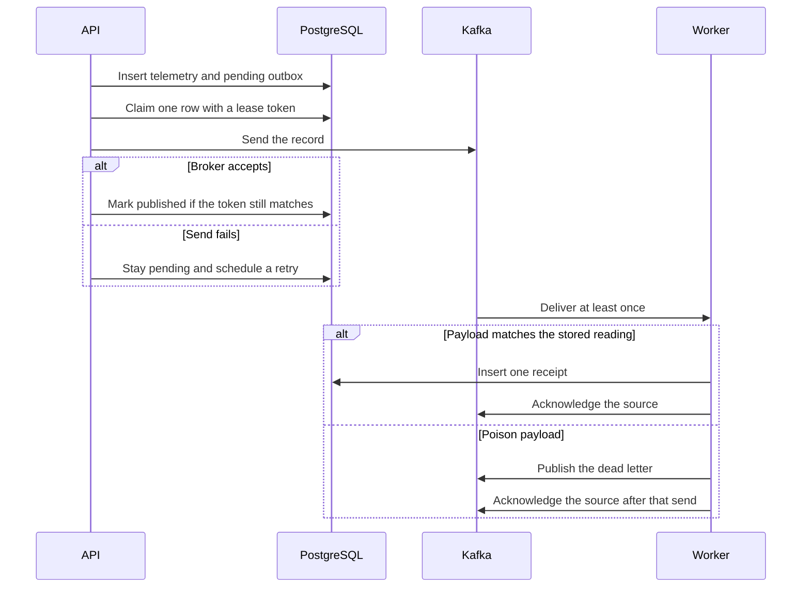

# Outbox publisher and worker

```mermaid
sequenceDiagram
  participant API
  participant DB as PostgreSQL
  participant Kafka
  participant Worker
  API->>DB: Insert telemetry and pending outbox
  API->>DB: Claim one row with a lease token
  API->>Kafka: Send the record
  alt Broker accepts
    API->>DB: Mark published if the token still matches
  else Send fails
    API->>DB: Stay pending and schedule a retry
  end
  Kafka->>Worker: Deliver at least once
  alt Payload matches the stored reading
    Worker->>DB: Insert one receipt
    Worker->>Kafka: Acknowledge the source
  else Poison payload
    Worker->>Kafka: Publish the dead letter
    Worker->>Kafka: Acknowledge the source after that send
  end
```

A crash after the broker acknowledgement and before the outbox update can publish the record again. The receipt primary key blocks a second business effect.
