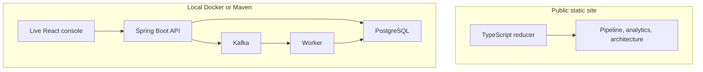

# Browser simulation and the Java stack

```mermaid
flowchart TB
  subgraph publicSite [Public static site]
    sim[TypeScript reducer]
    ui[Pipeline, analytics, architecture]
    sim --> ui
  end
  subgraph localStack [Local Docker or Maven]
    api[Spring Boot API]
    pg[PostgreSQL]
    kafka[Kafka]
    worker[Worker]
    console[Live React console]
    console --> api
    api --> pg
    api --> kafka
    kafka --> worker
    worker --> pg
  end
```

The public build does not import the API client. The live build does not replace `/devices`.
