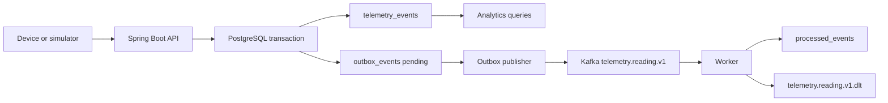

# Real telemetry flow

```mermaid
flowchart LR
  device[Device or simulator] --> api[Spring Boot API]
  api --> tx[PostgreSQL transaction]
  tx --> events[telemetry_events]
  tx --> outbox[outbox_events pending]
  events --> analytics[Analytics queries]
  outbox --> publisher[Outbox publisher]
  publisher --> kafka[Kafka telemetry.reading.v1]
  kafka --> worker[Worker]
  worker --> receipt[processed_events]
  worker --> dlt[telemetry.reading.v1.dlt]
```

Analytics read accepted rows. They do not wait for the worker.
